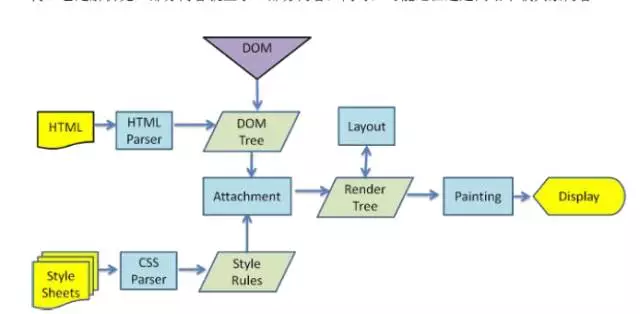

### html5

1. <!DOCTYPE> 声明位于文档中的最前面的位置，处于 <html> 标签之前。此标签可告知浏览器文档使用哪种 HTML 或 XHTML 规范。

2. 浏览器渲染过程[参考【浅析前端页面渲染机制】](https://mp.weixin.qq.com/s/1kQ-cyQmLfLcYiLiJ_ViwA)：


> 1. Create/Update DOM And request css、image、js－获取html并发起css、图片、js的请求和构建dom树
> 2. Create/Update Render CSSOM－CSS文件下载完成，开始构建CSSOM
> 3. Create/Update Render CSSOM－所有CSS文件下载完成，CSSOM构建结束后，和 DOM 一起生成 Render Tree。
> 4. Layout－计算每个节点在屏幕中的位置
> 5. Painting-绘制

3. 回流（reflow）和重绘（repain）[参考【网页性能管理详解】](https://mp.weixin.qq.com/s/tZHd987KRQKjoDLfFSEYEQ)：
> 1. 重构－指改变每个元素外观时所出发的浏览器行为，比如样式发生了改变，重构不会引发页面的重新布局，不一定伴随着回流
> 2. 回流－指的是浏览器为了重新渲染页面的需要而进行的重新计算元素的几何大小和位置。（当需要操作某一块元素的时候，最好使其脱离文档流，这样就不会引起回流了（例如： position:absolute））
> 1. 引起浏览器回流`修改DOM`，`修改样式表`，`用户事件（比如鼠标悬停、页面滚动、输入框键入文字、改变窗口大小等等）`
> 2. 注： "重绘"不一定需要"回流"，比如改变某个网页元素的颜色，就只会触发"重绘"，不会触发"回流"，因为布局没有改变。但是，"回流"必然导致"重绘"，比如改变一个网页元素的位置，就会同时触发"回流"和"重绘"，因为布局改变了。
> 3. window.requestAnimationFrame()  //下一次重新渲染时执行
> 4. window.requestIdleCallback()    //只有当一帧的末尾有空闲时间，才会执行回调函数
```javascript
$(window).on('scroll', function() {
  window.requestAnimationFrame(scrollHandler);
});
```

4. 浏览器内核：
> 1. IE浏览器的内核Trident、Mozilla的Gecko、Chrome的Blink（WebKit的分支）、Opera内核原为Presto，现为Blink

5. websocket: 可以让我们建立客户端到服务器端端全双工通信，这就意味着服务器端可以主动推送数据到客户端

6. webstorage-本地存储
> 1. localStorage:	持久化存储在客户端，用户不主动删除，就不会消失
> 2. sessionStorage:		存在时间是一个回话，一旦关于该回话的页面关闭就会消失
> 3. 注：cookie（4kb）是存储在浏览器端并且随浏览器的请求一起发送给服务器端

7. manifest-缓存
8. [跨域及解决方案](./cross.md)
> 1. document.domain+iframe的设置
> 2. 动态创建script
> 3. 利用iframe和location.hash
> 4. window.name实现的跨域数据传输
> 5. 使用HTML5 postMessage

```javascript
a.com/index.html中的代码：

<iframe id="ifr" src="b.com/index.html"></iframe>
<script type="text/javascript">
window.onload = function() {
    var ifr = document.getElementById('ifr');
    var targetOrigin = 'http://b.com';  // 若写成'http://b.com/c/proxy.html'效果一样
                                        // 若写成'http://c.com'就不会执行postMessage了
    ifr.contentWindow.postMessage('I was there!', targetOrigin);
};
</script>

b.com/index.html中的代码：

<script type="text/javascript">
    window.addEventListener('message', function(event){
        // 通过origin属性判断消息来源地址
        if (event.origin == 'http://a.com') {
            alert(event.data);    // 弹出"I was there!"
            alert(event.source);  // 对a.com、index.html中window对象的引用
                                  // 但由于同源策略，这里event.source不可以访问window对象
        }
    }, false);
</script>

```

9. 优化
> 1. 使用css sprites(将一个页面涉及到的所有零星图片都包含到一张大图中去)可以减少http请求数
> 2. 使用缓存
> 3. 压缩js，css文件
> 4. 使用cdn减小服务器负担
> 5. 懒加载图片
