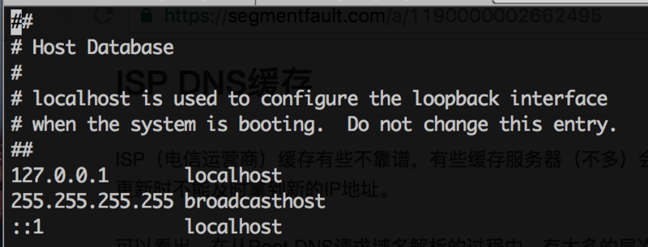
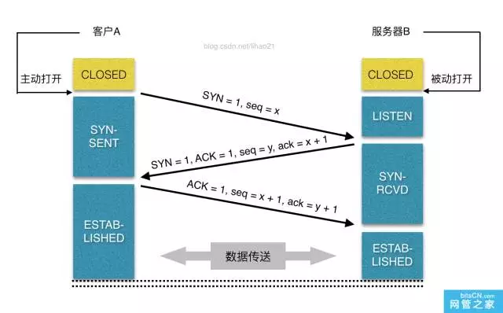
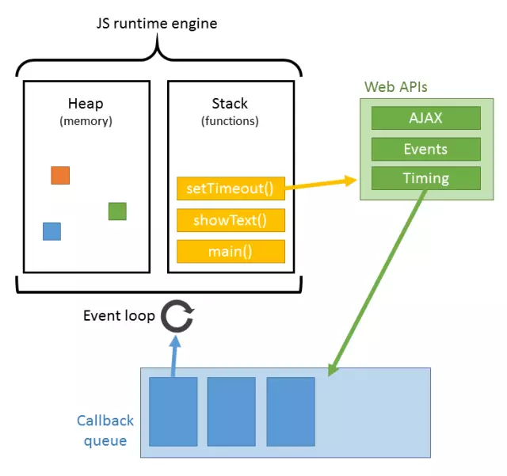

###从输入url到页面展示到底发生了什么

1. 输入地址

2. 浏览器查找域名的IP地址
> 1. 查看本地硬盘的hosts文件，若存在这个域名对应的规则则直接使用hosts文件里面的ip地址
> 2. 如果本地的hosts文件没有匹配的规则浏览器则会发出一个DNS请求到本地DNS服务器
> 3. DNS服务器将IP地址返回给用户电脑




3. 浏览器向web服务器发送一个HTTP请求
> 1. 拿到域名对应的IP地址之后，浏览器会以一个随机端口（1024 < 端口 < 65535）向对应IP地址的服务器的80端口发起TCP请求
> 2. 请求信息包含三部分`请求第一行是方法URL协议/版本`，`请求头`，`请求正文`


```javascript

//  请求行 URL协议/版本
GET/sample.jsp
HTTP/1.1   Accept:image/gif.image/jpeg,*/*

//   请求头
Accept-Language:zh-cn   
Connection:Keep-Alive   
Host:localhost   
User-Agent:Mozila/4.0(compatible;MSIE5.01;Window NT5.0)   
Accept-Encoding:gzip,deflate   

//   请求正文
username=jinqiao&password=1234

```

4. 服务器的永久重定向响应
> 1. 服务器给浏览器响应一个永久重定向响应

5. 浏览器跟踪重定向地址
> 1. 浏览器发起重定向地址请求

6. 服务器处理请求

7. 服务器返回一个HTTP响应
> 1.  http响应由3个部分构成 `状态行`， `响应头`， `响应正文`
>
> 2. 1**: 临时响应
> 3. 2**: 请求成功 （200:成功，202:服务器接受请求但未处理，204:处理成功但不需要返回任何实体内容）
> 4. 3**: 表示重定向  （301: 永久重定向，302:暂时重定向，304:浏览器端缓存资源依然有效）
> 5. 4**: 客服端错误  （400: 请求有无，服务器无法理解， 401: 请求需要用户验证，403:服务器拒绝执行，404:找不到资源）
> 6. 5**: 服务器端错误  （500: 服务器内部错误， 502: 网关出错， 503: 临时服务器维护或者过载）

```javascript
function createxmlRequest() {
  var xmlhttp;
  if (window.XMLHttpRequest) {
    xmlhttp = new window.XMLHttpRequest()
  } else {
    xmlhttp = new ActiveXObject("Microsoft.XMLHTTP");
  }
}
function createRequest() {
  xmlhttp.onreadystatechange = callbacksuccess
  xmlhttp.open('open', url, true);   //true 是否异步
  xmlhttp.setRequestHeader("Content-type","application/x-www-form-urlencoded");
  xmlhttp.send(data)
}
function callbacksuccess() {
  if (xmlhttp.readyState==4 && xmlhttp.status==200) {
    //服务器返回数据为xmlhttp.responseText
  }
}
```


8. 浏览器显示HTML
> 1. 解析html构建dom树->构建render树->布局render树->绘制render树
> 2. 页面在首次加载时必然会经历`reflow(回流)`和`repain(重绘)`。`reflow`和`repain`过程是非常消耗性能的，尤其是在移动设备上，它会破坏用户体验，有时会造成页面卡顿。所以我们应该尽可能少的减少reflow和repain。




9. 浏览器发送请求获取嵌入在HTML中的资源（如图片、音频、视频、css、js等等）

[参考【从输入url到页面展示到底发生了什么】](https://segmentfault.com/a/1190000006879700)
