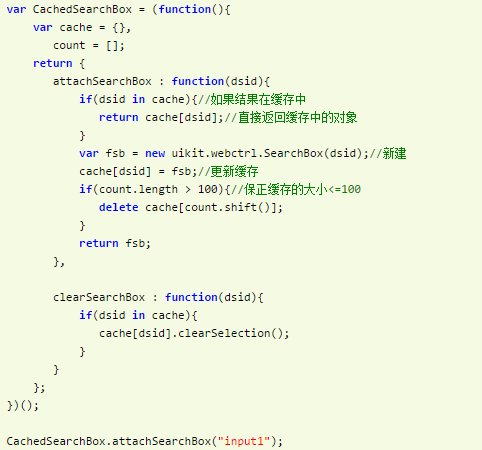

### 内存空间

1. `栈`与`堆`（栈，也可以叫堆栈）
> 栈的存取方式
> 
>
> 堆存取数据的方式好比在JSON格式的数据中，我们存储的key-value是可以无序的
2. 引用数据类型与堆内存

```javascript
var a1 = 0;   // 变量对象
var a2 = 'this is string'; // 变量对象
var a3 = null; // 变量对象

var b = { m: 20 }; // 变量b存在于变量对象中，{m: 20} 作为对象存在于堆内存中
var c = [1, 2, 3]; // 变量c存在于变量对象中，[1, 2, 3] 作为对象存在于堆内存中

```


```javascript
var a = 20;
var b = a;
b = 30;
```


```javascript
var m = { a: 10, b: 20 }
var n = m;
n.a = 15;
```


### 执行上下文


1. 执行上下文的生命周期可以分为两个阶段
> 1. 创建阶段-在这个阶段中，执行上下文会分别创建变量对象，建立作用域链，以及确定this的指向
> 2. 代码执行阶段-创建完成之后，就会开始执行代码，这个时候，会完成变量赋值，函数引用，以及执行其他代码。
> 
2. 变量对象的创建
> 1. 建立arguments对象
> 2. 检查当前上下文的函数声明，也就是使用function关键字声明的函数
> 3. 检查当前上下文中的变量声明，每找到一个变量声明，就在变量对象中以变量名建立一个属性，属性值为undefined
> 

### [作用域链与闭包](http://www.jianshu.com/p/21a16d44f150)
> 闭包是指有权访问另一个函数作用域中的变量的函数. 创建闭包常见方式,就是在一个函数内部创建另一个函数
> 
> 1.匿名自执行函数
>
> 
>
> 2.缓存
>
> 
>
> 3.实现封装
>
> 

### this取值--在函数中this到底取何值，是在函数真正被调用执行的时候确定的

1. 构造函数
```javascript
function Foo(){ this.name = "test"; console.log(this) //Foo {name: "test"}}
var f1 = new Foo();
```
2. 直接执行
```javascript
  function Foo(){ this.name = "test"; console.log(this) //Foo window}
  Foo();
```
3. 函数作为对象的一个属性
```javascript
  var obj = {
    x: 10,
    fn: function() {
      console.log(this); //object {x:10, fn:function}
    }
  }
注： 若 var fn1 = obj.fn; fn1() //此时this为window
```
4. 使用call或apply调用
```javascript
  apply和call都能继承另外一个对象的方法和属性；
  Function.apply(obj, args) args是一个数组,作为参数传给Function
  Function.call(obj, arg1, arg2,...)  arg*是参数列表
  bind()函数会创建一个新函数, 为绑定函数。
```

### [js继承：](./object.md)
> 每个函数都有一个属性叫做prototype。这个prototype的属性值是一个对象（属性的集合，再次强调！），默认的只有一个叫做constructor的属性，指向这个函数本身。

### new操作符：
```javascript
new Animal("cat")
=>	var obj = {}
  obj.__proto__ = Animal.prototype;
  var result = Animal.call(obj, "cat");
  return typeof reslut === 'object'? reslut: obj;
```

### 数据类型：
> 1. 原始类型： number、string、boolean、undefined、null
> 2. 混合数据类型： object

### js事件模型：
> 1. 事件捕获和事件冒泡--addEventListener('事件名称','事件回调','捕获/冒泡')
> 2. element.addEventListener(event, function, useCapture)  // useCapture  false- false- 默认。事件句柄在冒泡阶段执行  true - 事件句柄在捕获阶段执行
> 3. stopPropagation方法就是起到阻止js事件冒泡的作用
> 4. preventDefault方法就是可以阻止它的默认行为的发生而发生其他的事情
> 

### 垃圾回收机制：
> 这是javascript中最常用的垃圾回收方式。当变量进入执行环境是，就标记这个变量为“进入环境”。从逻辑上讲，永远不能释放进入环境的变量所占用的内存，因为只要执行流进入相应的环境，就可能会用到他们。当变量离开环境时，则将其标记为“离开环境”。垃圾收集器在运行的时候会给存储在内存中的所有变量都加上标记。然后，它会去掉环境中的变量以及被环境中的变量引用的标记。而在此之后再被加上标记的变量将被视为准备删除的变量，原因是环境中的变量已经无法访问到这些变量了。最后。垃圾收集器完成内存清除工作，销毁那些带标记的值，并回收他们所占用的内存空间。
