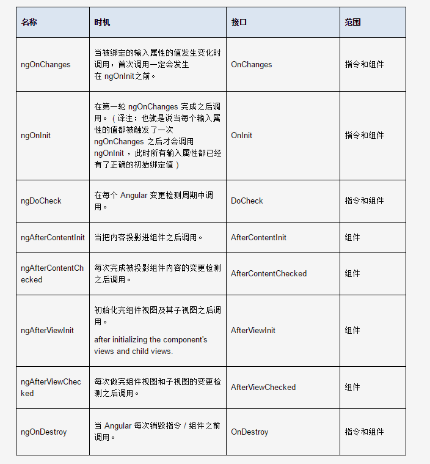

```javascript

    function Scope(){
        this.$$watchers = [];
    }
    
    Scope.prototype.$watch = function(watchFn, listenerFn) {
      var watcher = {
        watchFn: watchFn,
        listenerFn: listenerFn || function() {}
      };
      this.$$watchers.push(watcher);
    };

    Scope.prototype.$digest = function() {
      _.forEach(this.$$watchers, function(watch) {
        watch.listenerFn();
      });  
    };
```
[脏值监测机制--数据双向绑定](./dirty.md)

```javascript
  ng2 生命周期
```

```javascript
  Reactive Programming  响应式编程
  zone 上下文执行环境
```
