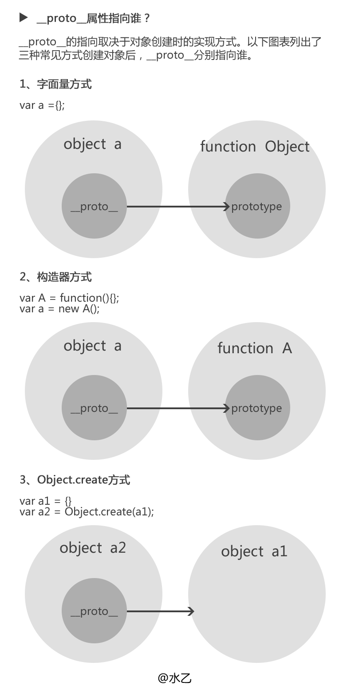

### js原型和原型链

> 1. JavaScript 中，万物皆对象！但对象也是有区别的。分为普通对象和函数对象，`Object` ，`Function` 是JS自带的函数对象
> 2. 凡是通过 `new Function()` 创建的对象都是函数对象，其他的都是普通对象 。注：普通对象没有`prototype`,但有`__proto__`属性

```javascript
function f1(){};
console.log(f1.prototype) //f1{}  f1.prototype就是f1的一个实例对象
console.log(typeof f1. prototype) //Object
console.log(typeof Function.prototype) // Function，这个特殊
console.log(typeof Object.prototype) // Object
console.log(typeof Function.prototype.prototype) //undefined

//是在f1创建的时候,创建了一个它的实例对象并赋值给它的prototype，基本过程如下：
 var temp = new f1();
 f1.prototype = temp;

//Function.prototype为什么是函数对象，凡是new Function ()产生的对象都是函数对象，所以temp1是函数对象。
 var temp1 = new Function ();
 Function.prototype = temp1;
```
> 3. 原型链：无论`普通对象`还是`函数对象`，都有一个叫做`__proto__`的内置属性，用于指向创建它的`函数对象`的原型对象`prototype`(`普通对象`)
> 

```javascript
console.log(zjh.__proto__ === person.prototype) //true
console.log(person.prototype.__proto__ === Object.prototype) //true
console.log(Object.prototype.__proto__) //null

Object.__proto__ === Function.prototype // true
//Object是函数对象，是通过new Function()创建，所以Object.__proto__指向Function.prototype。

Function.__proto__ === Function.prototype // true
//Function 也是对象函数，也是通过new Function()创建，所以Function.__proto__指向Function.prototype。

Function.prototype.__proto__ === Object.prototype
Object.prototype.__proto__ === null

```
> 4. constructor原型对象prototype中都有个预定义的constructor属性，用来引用它的函数对象
```javascript
person.prototype.constructor === person //true
Function.prototype.constructor === Function //true
Object.prototype.constructor === Object //true
```





```javascript

console.dir(Object)

```


```javascript

var a = { "aa": "1" }  //console.dir(a)

```


```javascript

function h() {}
var i = new h();
console.dir(i);

```


```javascript

hasOwnProperty(propertyName)  // hasOwnProperty是用来判断一个对象是否有你给出名称的属性或对象。不过需要注意的是，此方法无法检查该对象的原型链中是否具有该属性，该属性必须是对象本身的一个成员

// var a = new Object({aa: '1'});
// console.dir(Object);
// console.dir(a);
// console.log(
// 	 a.hasOwnProperty('aa')		// true
// );
// console.log(
// 	 a.hasOwnProperty('toString')   // false
// );

isPrototypeOf(Object)   // isPrototype方法接收一个对象，用来判断当前对象是否在传入的参数对象的原型链上

// function MyObject() {}
// var obj = new MyObject();
// var obj2 = {};
// console.log("isPrototypeOf(obj):" + Object.prototype.isPrototypeOf(obj));		// true
// console.log("isPrototypeOf(obj2):" + Object.prototype.isPrototypeOf(obj2));		// true

propertyIsEnumerable(prototypeName)   //prototypeIsEnumerable用来判断给定的属性是否可以被for..in语句给枚举出来

// var obj3 = { name: "objName" }
// for (var i in obj3) {
// 	 console.log(i); 	// name
// }
// console.log(obj3.propertyIsEnumerable("constructor"))   // false
// console.log(obj3.propertyIsEnumerable("name"))			// true

// 不同对象产生的结果不一样
valueOf()
toString()
toLocaleString()
// var array = new Array("niu","li","na");
// console.log(array.valueOf());        //返回数组本身
// console.log(array.toString());       //把数组转换为字符串，并返回结果，每一项以逗号分割。
// console.log(array.toLocaleString()); //把数组转换为本地数组，并返回结果。LocaleString()会根据你机器的本地环境来返回字符串，它和toString()返回的值在不同的本地环境下使用的符号会有微妙的变化。


```


继承

```javascript

	var newObj = {}
	console.log(newObj.__proto__)                 //Object {}
	var newObj2 = new Object()
	console.log(newObj2.__proto__)                //Object {}


	function Obj () {}
	var obj = new Obj();

	console.log(Obj)                               //function Obj() {}
	console.log(Obj.__proto__)                     //function () {}
	console.log(Obj.__proto__.__proto__)           //Object {}
	console.log(obj)                               //Obj {}
	console.log(obj.__proto__) === console.log(Obj.prototype)                    //Object {constructor:Obj(),__proto__:Object}
	console.log(obj.__proto__.__proto__)           //Object {}

```
