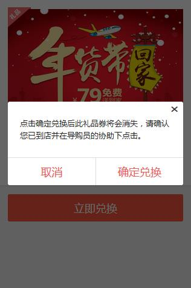

1. 1px像素解决方案
> 原因：css中的1px并不等于移动设备的1px
> devicePixelRatio的官方的定义为：设备物理像素和设备独立像素的比例，也就是 devicePixelRatio = 物理像素 / 独立像素。

2. click、tap、touch
> click点击延迟200-300ms,所以一般用tap代替click作为点击事件。singleTap 和doubleTap分别代表单次点击和双次点击
> click点击延迟原因： 双击放大
> 解决方案：
> 1. 禁用缩放功能  <meta name="viewport" content="width=device-width, user-scalable=no">
> 2. FastClick一个轻量级的库，FastClick 在检测到 touchend 事件的时候，会通过 DOM 自定义事件立即触发一个模拟 click 事件，并把浏览器在 300 毫秒之后真正触发的click事件阻止
click会有200-300ms的延迟，所以一般用tap代替click作为点击事件。singleTap 和doubleTap分别代表单次点击和双次点击
>

3. tap的穿透原因
> 
>
> zepto的tap通过兼听绑定在document上的touch事件来完成tap事件的模拟的,及tap事件是冒泡到document上触发的，再点击完成时的tap事件(touchstart\touchend)需要冒泡到document上才会触发，而在冒泡到document之前，用 户手的接触屏幕(touchstart)和离开屏幕(touchend)是会触发click事件的,因为click事件有延迟触发(这就是为什么移动端不 用click而用tap的原因)(大概是300ms,为了实现safari的双击事件的设计)，所以在执行完tap事件之后，弹出来的选择组件马 上就隐藏了，此时click事件还在延迟的300ms之中，当300ms到来的时候，click到的其实不是完成而是隐藏之后的下方的元素，如果正下方的 元素绑定的有click事件此时便会触发，如果没有绑定click事件的话就当没click，但是正下方的是input输入框(或者select选择框或 者单选复选框)，点击默认聚焦而弹出输入键盘，也就出现了上面的点透现象。

4. 点击执行顺序
> 点击 ：touchstart touchend click
>
> 按下鼠标， 移动， 松开鼠标  ：touchstart touchmove touchend  （不会出发click事件）
