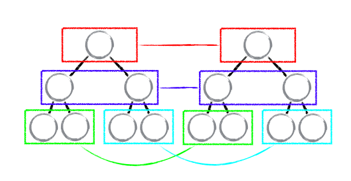
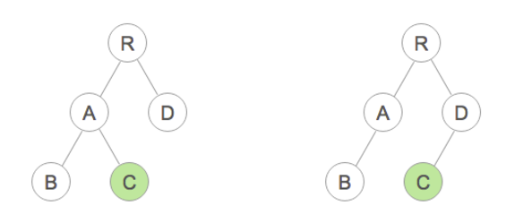
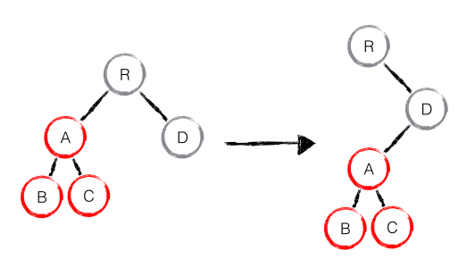
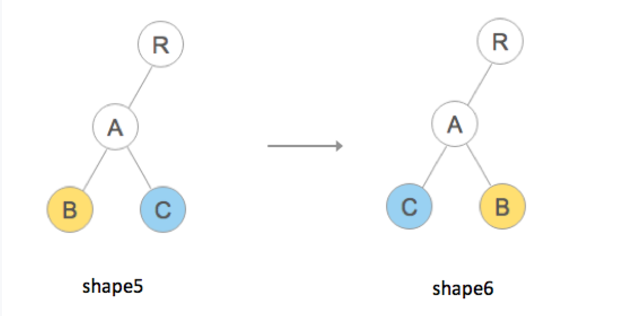
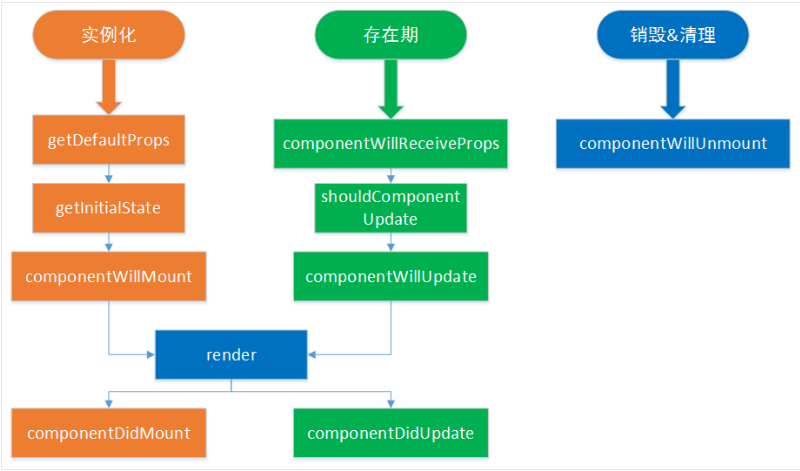
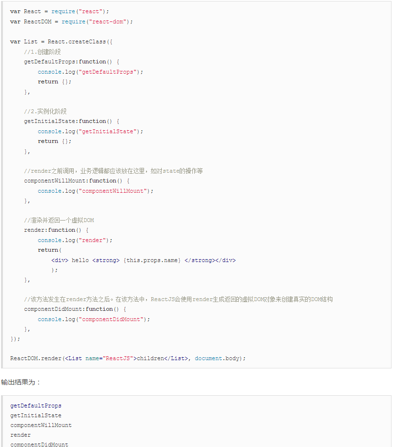
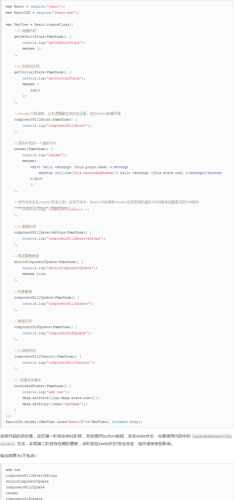

```javascript
diff 策略(参考：https://supnate.github.io/react-dom-diff/index.html)
  1.tree diff
    树进行分层比较，两棵树只会对同一层次的节点进行比较。
```
  
  
```javascript
    C will unmount.
    C is created.
    B is updated.
    A is updated.
    C did mount.
    D is updated.
    R is updated.
    React 只会简单的考虑同层级节点的位置变换，而对于不同层级的节点，只有创建和删除操作。
    当根节点发现子节点中 A 消失了，就会直接销毁 A；当 D 发现多了一个子节点 A，则会创建新的 A（包括子节点）作为其子节点。此时，React diff 的执行情况：create A -> create B -> create C -> delete A。(如下图)因此 React 官方建议不要进行 DOM 节点跨层级的操作。
```
  
```javascript
    A.destroy();
    A = new A();
    A.append(new B());
    A.append(new C());
    D.append(A);

  2.component diff

  3.element diff
    React diff 提供了三种节点操作，分别为：INSERT_MARKUP（插入）、MOVE_EXISTING（移动）和 REMOVE_NODE（删除）。
```

```javascript
    B will unmount.
    C will unmount.
    C is created.
    B is created.
    C did mount.
    B did mount.
    A is updated.
    R is updated.
```

组件通信
```javascript
props   父 -> 子

// 父组件
var MyContainer = React.createClass({
  getInitialState: function () {
    return {
      checked: true
    };
  },
  render: function() {
    return (
      <ToggleButton text="Toggle me" checked={this.state.checked} />
    );
  }
});

// 子组件
var ToggleButton = React.createClass({
  render: function () {
    // 从【父组件】获取的值
    var checked = this.props.checked,
        text = this.props.text;

    return (
        <label>{text}: <input type="checkbox" checked={checked} /></label>
    );
  }
});


props  子 -> 父

// 父组件
var MyContainer = React.createClass({
  getInitialState: function () {
    return {
      checked: false
    };
  },
  onChildChanged: function (newState) {
    this.setState({
      checked: newState
    });
  },
  render: function() {
    var isChecked = this.state.checked ? 'yes' : 'no';
    return (
      <div>
        <div>Are you checked: {isChecked}</div>
        <ToggleButton text="Toggle me"
          initialChecked={this.state.checked}
          callbackParent={this.onChildChanged}
          />
      </div>
    );
  }
});

// 子组件
var ToggleButton = React.createClass({
   getInitialState: function () {
    return {
      checked: this.props.initialChecked
    };
  },
  onTextChange: function () {
    var newState = !this.state.checked;
    this.setState({
      checked: newState
    });
    // 这里要注意：setState 是一个异步方法，所以需要操作缓存的当前值
    this.props.callbackParent(newState);
  },
  render: function () {
    // 从【父组件】获取的值
    var text = this.props.text;
    // 组件自身的状态数据
    var checked = this.state.checked;

    return (
        <label>{text}: <input type="checkbox" checked={checked} onChange={this.onTextChange} /></label>
    );
  }
});


无关系型
rxjs, 


```


生命周期



生命周期之实例化



生命周期之存在期



生命周期之销毁&清理

componentWillUnmount