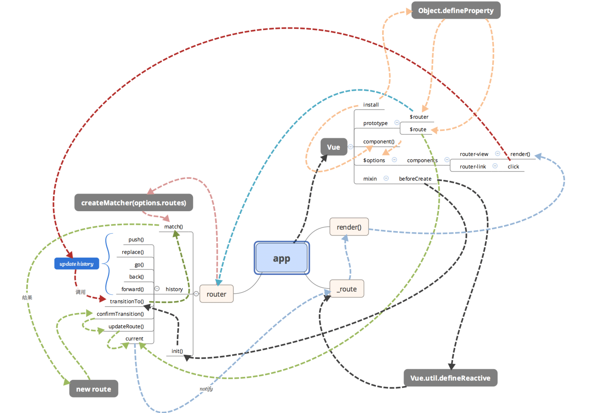

```javascript
vue 实现原理
  1. 首先，需要利用Object.defineProperty，将要观察的对象，转化成getter/setter，以便拦截对象赋值与取值操作，称之为Observer；
  2. 需要将DOM解析，提取其中的指令与占位符，并赋与不同的操作，称之为Compiler；
  3. 需要将Compile的解析结果，与Observer所观察的对象连接起来，建立关系，在Observer观察到对象数据变化时，接收通知，同时更新DOM，称之为Watcher；
  4. 最后，需要一个公共入口对象，接收配置，协调上述三者，称为Vue;
vue 双向绑定 
  数据劫持：采用数据劫持结合发布者-订阅者模式的方式，通过Object.defineProperty()来劫持各个属性的setter，getter，在数据变动时发布消息给订阅者，触发相应的监听回调。
```
vue 通信机制

1.props数据传递

```javascript
// parent.vue
<appFooter my-message="组件内部数据传递"></appFooter>

// child.vue
<template>
	{{myMessage}}
</template>
<script>
	export default {
	  name: 'footer',
	  props: ['myMessage'],
	}
</script>
```

2.父子传递，子父传递，兄弟传递

```javascript

Bus.$emit('add',this.msg);
Bus.$on('add',function(msg){
	  _this.msg=msg;
 });

// Bus.js
import Vue from "vue";
export default new Vue();

// parent.vue
<script>
import Bus from '../public/Bus';
export default {
   name: 'newstockrule',
   data(){
    return {
      msg:"this is bar data"
    }
   },
   components: {
      appFooter: Footer
   },
   methods: {
    add (msg) {
      Bus.$emit('add',this.msg);
    }
}
</script>

// child.vue
<template>
	{{msg}}
</template>
<script>
	import Bus from '../public/Bus';
	export default {
	  name: 'footer',
	   data () {
	    return {
	      msg: 'this is foo data'
	    }
	  },
	  mounted:function(){
	    var _this=this;
	    Bus.$on('add',function(msg){
	      _this.msg=msg;
	    });
	  }
	}
</script>
```

vue-router



[vue-router 实现分析](http://cnodejs.org/topic/58d680c903d476b42d34c72b)
[vue-router 源码分析-整体流程](http://www.tuicool.com/articles/jQRnIrF)
